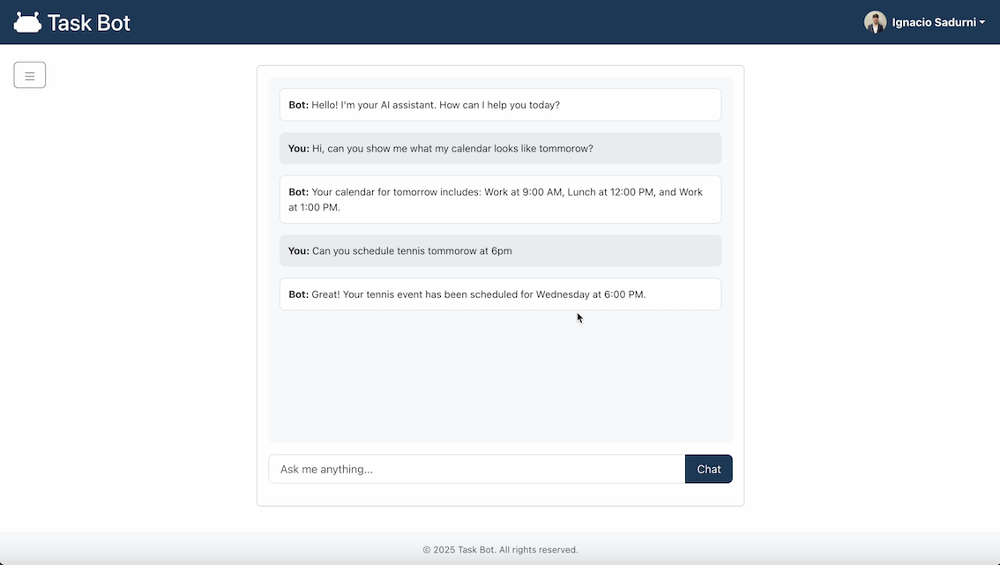

# Task Bot 🤖

Task Bot is an intelligent AI assistant that helps you manage your calendar and schedule tasks through natural language conversations. It integrates with Google Calendar and provides a modern, user-friendly interface for seamless task management.

[**Click on the image to watch a video demo!**](https://youtu.be/aWEhcZcObjc?si=uKZ6SL6fycWw-CxO)
[](https://youtu.be/aWEhcZcObjc?si=uKZ6SL6fycWw-CxO)

## Features ✨

- **Natural Language Processing**: 
  - Powered by LangChain and OpenAI
  - Context-aware conversations
  - Intelligent task understanding
  - Dynamic response generation
- **Calendar Management**: 
  - Create, view, and delete calendar events
  - Get event summaries
- **Modern UI/UX**:
  - Clean and intuitive interface
  - Real-time chat experience
  - Responsive design

## Tech Stack 🛠

### Frontend
- React 18
- Vite
- Bootstrap 5
- TypeScript
- React Router DOM

### Backend
- FastAPI (Python)
- LangChain
- Google Calendar API
- OpenWeatherMap API
- OpenAI API
- Python-dotenv

### Authentication
- Google OAuth 2.0
- Session-based authentication

## Prerequisites 📋

- Python 3.8+
- Node.js 16+
- npm or yarn
- Google Cloud Platform account
- OpenWeatherMap API key
- OpenAI API key

## Environment Variables 🔑

Create a `.env` file in the backend directory with the following variables:

```env
GOOGLE_CLIENT_ID=your_google_client_id
GOOGLE_CLIENT_SECRET=your_google_client_secret
OPENAI_API_KEY=your_openai_api_key
OPENWEATHER_API_KEY=your_openweather_api_key
```

## Installation 🚀

1. Clone the repository:
```bash
git clone https://github.com/yourusername/task-bot.git
cd task-bot
```

2. Install backend dependencies:
```bash
cd backend
python -m venv venv
source venv/bin/activate  # On Windows: venv\Scripts\activate
pip install -r requirements.txt
```

3. Install frontend dependencies:
```bash
cd frontend
npm install
```

## Running the Application 🏃‍♂️

1. Start the backend server:
```bash
cd backend
uvicorn main:app --reload
```

2. Start the frontend development server:
```bash
cd frontend
npm run dev
```

The application will be available at:
- Frontend: http://localhost:5173
- Backend API: http://localhost:8000

## Usage Examples 💡

### Calendar Management
- "Schedule a meeting with John tomorrow at 2 PM"
- "What's on my calendar tommorow?"

## Contributing 🤝

1. Fork the repository
2. Create your feature branch (`git checkout -b feature/AmazingFeature`)
3. Commit your changes (`git commit -m 'Add some AmazingFeature'`)
4. Push to the branch (`git push origin feature/AmazingFeature`)
5. Open a Pull Request

## Contact 📧

Ignacio Sadurni - ignaciosadurni@gmail.com

Project Link: [https://github.com/isadurni/task-bot](https://github.com/isadurni/task-bot)
